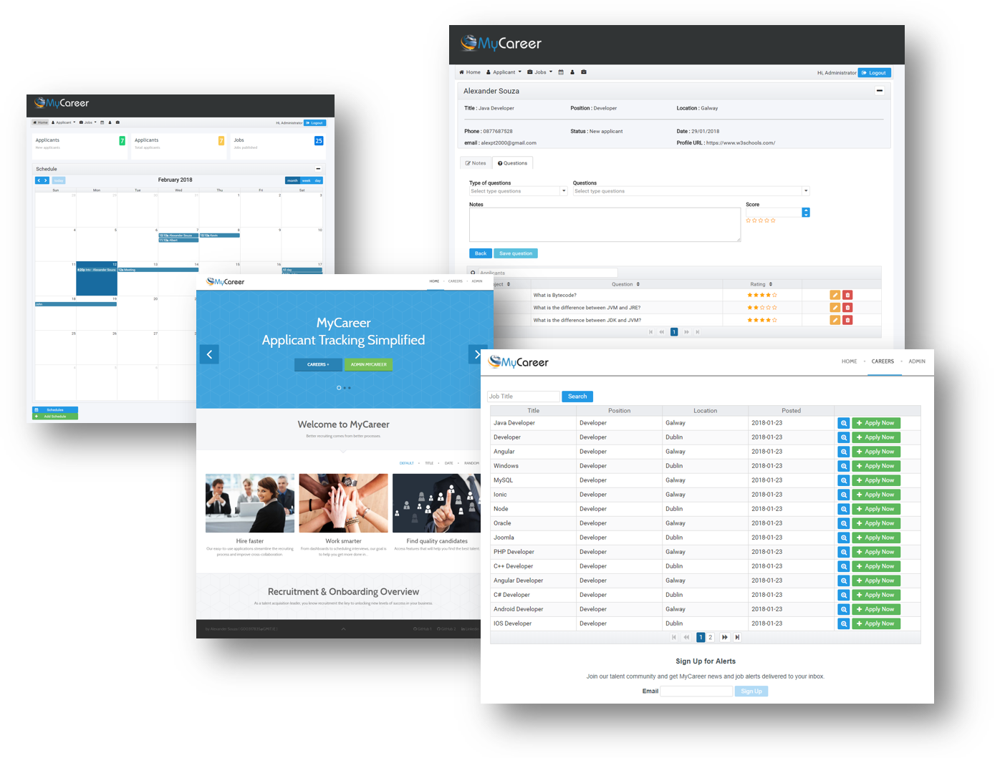
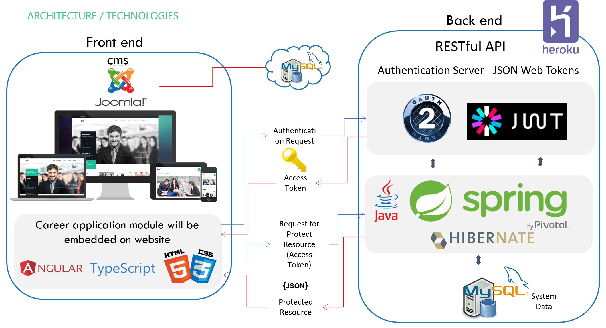
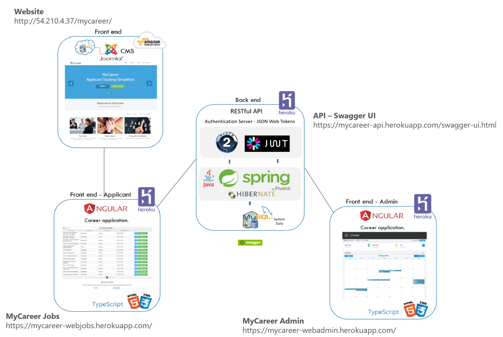
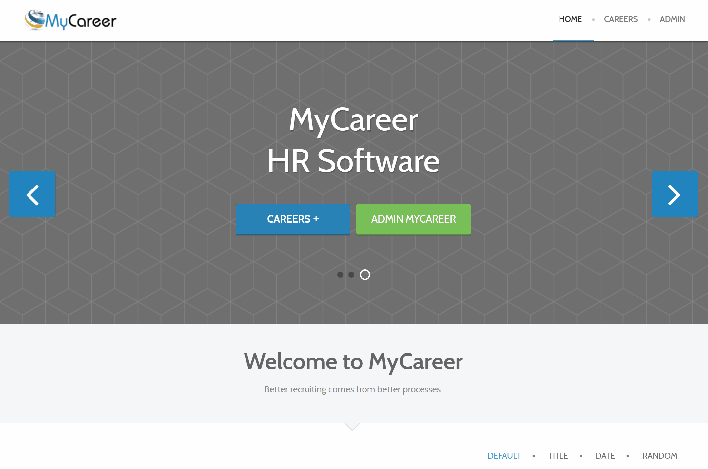
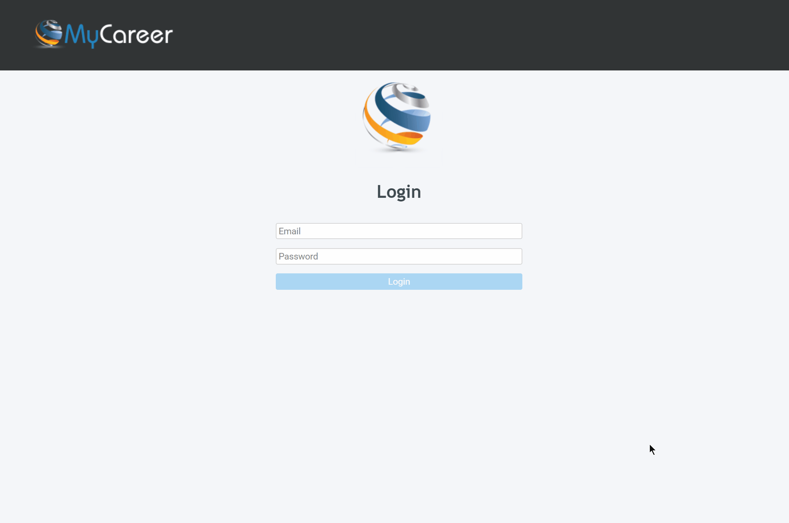
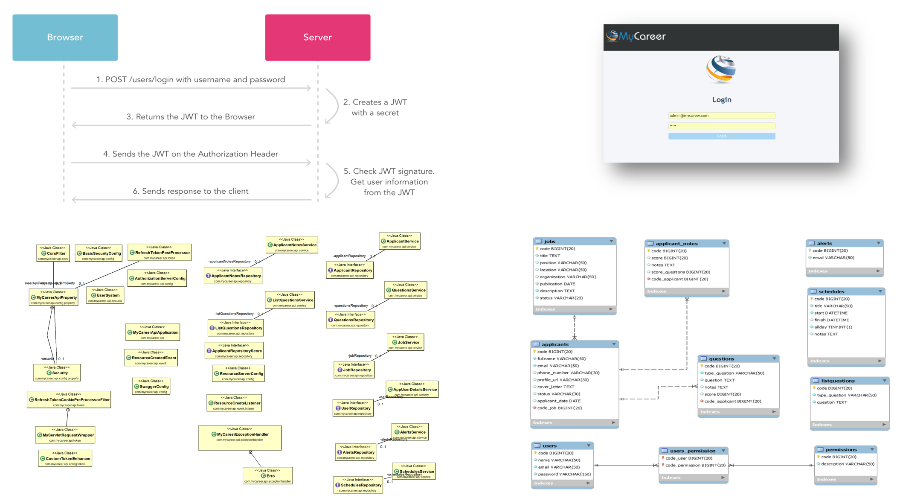

# 4th Year - Final year project.
### APPLIED PROJECT AND MINOR DISSERTATION

### Applicant Tracking System


### Alexander Souza - G00317835@gmit.ie
### Supervisor - Damien Costello
- Website - http://54.210.4.37/mycareer/
- MyCareer WebJobs - https://mycareer-webjobs.herokuapp.com/
- MyCareer Admin - https://mycareer-webadmin.herokuapp.com/
- YouTube screencast - https://youtu.be/6NChE0NcoLw

##### User and Password
```
Administrator user:
    admin@mycareer.com
    admin

Limited user:
    alex@mycareer.com
    alex
```

## The project


> MyCareer is a system that fully supports the recruitment and selection process of HR, provides an internal system to manage resumes, jobs, and a tool that can be integrated with the current system of the company that will make the company's own website in an online recruiter of candidates.

 
> MyCareer is an application that, in addition to being scalable, uses the best in development, appearance, security and robustness frameworks.

#### Applicants
- View available jobs.
- Apply for the selected work through the website.
- Submit the email to the job alert receipt

#### Administrator
- Manage all available jobs.
- View all applicants.
- View applicants per job.
- The process of evaluation of the candidate in the act of the interview.
- Assessment with technical questions for candidates, divided by topics.
- Manage schedule for interviews and other appointments.





#### Application deployed on AWS and Heroku:
- http://54.210.4.37/mycareer/

#### User and Password
```
Administrator user:
    admin@mycareer.com
    admin

Limited user:
    alex@mycareer.com
    alex
```


## Technology

> For this project I will use various technologies, techniques and tools, such as:

### IDE - Development environment
- Spring Tool Suite
- Visual Studio Code

### API - Back end 
- Spring Security
- JSON Web Token (JWT)
- Spring Boot
- Maven
- Hibernate
- Flyway
- Swagger UI

### Database Environment
- MySQL

### Front end
- Joomla
- HTML5 and CSS
- Angular 4
- PrimeNG - is a collection of rich UI components.

### Cloud services
- AWS
- Heroku


## UI - Website (Joomla)
> The system also demonstrates how the system can also be used on the company's current website, in which case it has been used by CMS Joomla, a powerful website development tool that allows users to manage website content from a backend.


#### Access URL for the Website page:
- http://54.210.4.37/mycareer/ 


## UI - front-end (Angular)
### Applicants
> Through the job application module, the applicant can view a list of all available jobs on the page and also be able to submit their personal data to the selected position.



#### Access URL for the front-end Applicants page:
- https://mycareer-webjobs.herokuapp.com/


## UI - MyCareer - Admin (Angular)
### Admin - Applicants
> Through this module, the administrator can manage the data provided by the API, such as:
- Manage published work;
- Manage applicants;
- Manage the system agenda;
- Candidate evaluation system;
- List of questions for the interview process.



#### MyCareer Admin
- https://mycareer-webadmin.herokuapp.com/


## API
### Spring boot

> For the MyCareer project, the API will serve as the data for the UI, the persistence of the data and also to ensure the security of the application.

This is a RESTful API that uses the following technologies:
- Spring Boot;
- String Security;
- JWT;
- Hibernate;

#### API – Swagger UI
- https://mycareer-api.herokuapp.com/swagger-ui.html




## Author

### Alexander Souza
- G00317835@gmit.ie
- alexpt2000@gmail.com
- https://github.com/alexpt2000gmit
- https://github.com/alexpt2000
- www.linkedin.com/in/souza-alexander


## Links
- GitHub - https://github.com/alexpt2000gmit/4Year_MainProject_MyCareer
- YouTube screencast - https://youtu.be/6NChE0NcoLw
- Website - http://54.210.4.37/mycareer/
- MyCareer Jobs - https://mycareer-webjobs.herokuapp.com/
- MyCareer Admin - https://mycareer-webadmin.herokuapp.com/
- API – Swagger UI - https://mycareer-api.herokuapp.com/swagger-ui.html

## References

- "Spring Data," Projects.spring.io, 2018. [Online]. Available: https://projects.spring.io/spring-data/. [Accessed 10 January 2018].
- "Projects: Spring Boot," Projects.spring.io, 2018. [Online]. Available: https://projects.spring.io/spring-boot/. [Accessed 10 January 2018].
- "Spring Security," Projects.spring.io, 2017. [Online]. Available: https://docs.spring.io/spring-security/site/docs/current/reference/htmlsingle/. [Accessed 01 October 2017].
- "Fielding Dissertation: CHAPTER 5: Representational State Transfer (REST)," Ics.uci.edu, [Online]. Available: http://www.ics.uci.edu/~fielding/pubs/dissertation/rest_arch_style.htm. [Accessed 13 Feb 2018].
- B. Proffitt, "What APIs Are And Why They're Important - ReadWrite," ReadWrite, [Online]. Available: https://readwrite.com/2013/09/19/api-defined/. [Accessed 02 Apr 2018].
- C. Walls, Spring Boot in Action, 2016.
- M. Jones, J. Bradley and N. Sakimura, "JSON Web Token (JWT)," Rfc-editor.org, [Online]. Available: http://www.rfc-editor.org/info/rfc7519.
- "Setting Up Swagger 2 with a Spring REST API | Baeldung," Baeldung, 2017. [Online]. Available: http://www.baeldung.com/swagger-2-documentation-for-spring-rest-api. [Accessed 5 Apr 2018].
- P. Otemuyiwa, "Securing Spring Boot with JWTs," Auth0 - Blog, [Online]. Available: https://auth0.com/blog/securing-spring-boot-with-jwts/. [Accessed 30 Feb 2018].
- "Secure a Spring Boot REST API With JSON Web Token + Reference to Angular Integration," Medium, [Online]. Available: https://medium.com/@nydiarra/secure-a-spring-boot-rest-api-with-json-web-token-reference-to-angular-integration-e57a25806c50. [Accessed 10 01 2018].
- T. Schimandle, "Spring Cloud - Adding Angular 4 | Baeldung," Baeldung, [Online]. Available: http://www.baeldung.com/spring-cloud-angular. [Accessed 12 Apr 2018].
- "Deploying Spring Boot Applications to Heroku | Heroku Dev Center," Devcenter.heroku.com, [Online]. Available: https://devcenter.heroku.com/articles/deploying-spring-boot-apps-to-heroku. [Accessed 12 Apr 2018].
- "How to Deploy Angular Application to Heroku – Tunmbi – Medium," Medium, 2018. [Online]. Available: https://medium.com/@hellotunmbi/how-to-deploy-angular-application-to-heroku-1d56e09c5147. [Accessed 12 Apri 2018].
- "Spring Boot, MySQL, JPA, Hibernate Restful CRUD API Tutorial," CalliCoder, 2018. [Online]. Available: https://www.callicoder.com/spring-boot-rest-api-tutorial-with-mysql-jpa-hibernate/. [Accessed 12 Apr 2018].
- "Enabling Cross Origin Requests for a RESTful Web Service," Spring.io, [Online]. Available: https://spring.io/guides/gs/rest-service-cors/. [Accessed 02 Apr 2018].
- "Installing Joomla on a P.C.," Ostraining.com, [Online]. Available: https://www.ostraining.com/books/je/pc/. [Accessed 10 Feb 2018].
- "Spring Boot Rest API Example - WebSystique," WebSystique, [Online]. Available: http://websystique.com/spring-boot/spring-boot-rest-api-example/. [Accessed 10 Jan 2018].
- P. Otemuyiwa, "Securing Spring Boot with JWTs," Auth0 - Blog, [Online]. Available: https://auth0.com/blog/securing-spring-boot-with-jwts/. [Accessed 20 Mar 2018].
