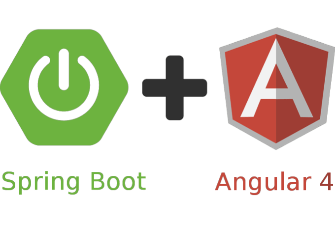
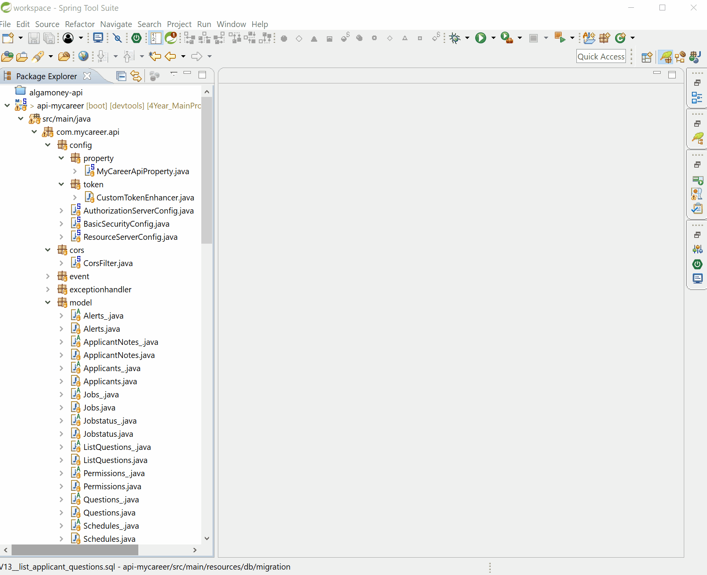

# 4Year_MainProject_MyCareer
### 45627 - APPLIED PROJECT AND MINOR DISSERTATION

 - My idea is an online system that would help in the process of recruiting and selecting candidates for position.
- The System will have a public access page, where the candidates can apply for the job available, and thus initiate the registration of your CV and relevant data.
- In the area of system administration, it would provide tools to manage job offers, manage CVs candidates, and manage the recruitment process by recruiters.

## Objectives
- Make notes about the candidates at the time of the interview;
- Create Technical Evaluations for candidates, with questions;
- Reports;
- Candidates will have scores for the position;
- Notification of new jobs to those enrolled in the Newsletter;
- Possibly Statistical Charts;

# Technology
## Angular 4, REST e Spring Boot

## UI - Website (Joomla)

## UI - front-end (Angular)

## UI - MyCareer - Admin (Angular)

## API - Spring (Java)

# Author

### Alexander Souza
- G00317835@gmit.ie
- alexpt2000@gmail.com
- https://github.com/alexpt2000gmit
- https://github.com/alexpt2000
- www.linkedin.com/in/alexander-souza-3a841539/
