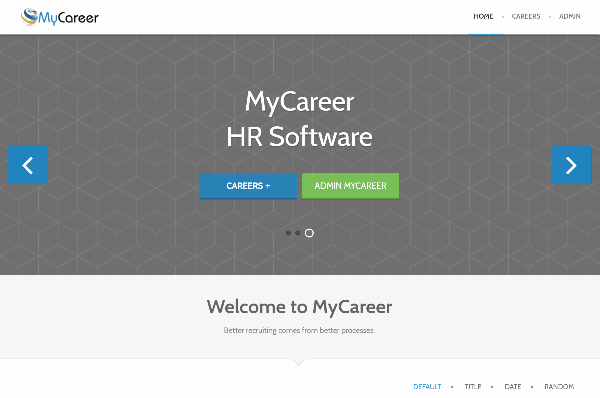
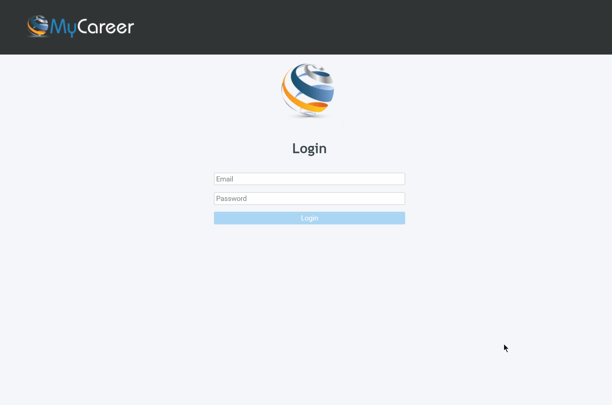

# 4th Year - Final year project.
### APPLIED PROJECT AND MINOR DISSERTATION

### Alexander Souza - G00317835@gmit.ie
### Supervisor - Damien Costello

## UI - front-end (Angular)
### Applicants
> Through the job application module, the applicant can view a list of all available jobs on the page and also be able to submit their personal data to the selected position.

#### Access URL for the front-end Applicants page:
- https://mycareer-webajobs.herokuapp.com/

## UI - MyCareer - Admin (Angular)
### Admin - Applicants
> Through this module, the administrator can manage the data provided by the API, such as:
- Manage published work;
- Manage applicants;
- Manage the system agenda;
- Candidate evaluation system;
- List of questions for the interview process.

#### MyCareer Admin
- https://mycareer-webadmin.herokuapp.com/